# PoizonMarket Backend

Backend API для интернет-магазина PoizonMarket.

## Требования

- Node.js (v14 или выше)
- PostgreSQL (v12 или выше)
- npm или yarn

## Установка

1. Клонируйте репозиторий:
```bash
git clone https://github.com/yourusername/poizonmarket.git
cd poizonmarket/server
```

2. Установите зависимости:
```bash
npm install
```

3. Создайте базу данных и пользователя:
```sql
CREATE DATABASE "poizonmarket-db";
CREATE USER "poizonmarket-user" WITH PASSWORD 'poizonmarket-user';
GRANT ALL PRIVILEGES ON DATABASE "poizonmarket-db" TO "poizonmarket-user";
```

4. Создайте файл .env на основе .env.example:
```bash
cp .env.example .env
```

5. Настройте переменные окружения в .env файле.

## Запуск

### Разработка
```bash
npm run start:dev
```

### Продакшн
```bash
npm run build
npm run start:prod
```

## API Документация

После запуска сервера, Swagger документация доступна по адресу:
```
http://localhost:3001/api
```

## Тестирование

```bash
# unit tests
npm run test

# e2e tests
npm run test:e2e
```

## Логирование

Логи сохраняются в директории `logs/`:
- `error.log` - логи ошибок
- `combined.log` - все логи

## Безопасность

- Все запросы ограничены rate limiting (10 запросов в минуту)
- Входные данные валидируются
- Используется JWT для аутентификации
- Пароли хешируются с помощью bcrypt 


Схема апи

# Архитектура сервера POIZON Market

## Структура проекта

```mermaid
graph TD
    A[App Module] --> B[Auth Module]
    A --> C[Users Module]
    A --> D[Products Module]
    A --> E[Categories Module]
    A --> F[Brands Module]
    A --> G[Cart Module]
    A --> H[Orders Module]
    A --> I[Payments Module]
    A --> J[Files Module]

    %% Auth Module
    B --> BA[Auth Controller]
    B --> BB[Auth Service]
    B --> BC[JWT Strategy]
    B --> BD[Local Strategy]

    %% Users Module
    C --> CA[Users Controller]
    C --> CB[Users Service]
    C --> CC[User Model]

    %% Products Module
    D --> DA[Products Controller]
    D --> DB[Products Service]
    D --> DC[Product Model]
    D --> DD[Product Variant Model]

    %% Categories Module
    E --> EA[Categories Controller]
    E --> EB[Categories Service]
    E --> EC[Category Model]

    %% Brands Module
    F --> FA[Brands Controller]
    F --> FB[Brands Service]
    F --> FC[Brand Model]

    %% Cart Module
    G --> GA[Cart Controller]
    G --> GB[Cart Service]
    G --> GC[Cart Item Model]

    %% Orders Module
    H --> HA[Orders Controller]
    H --> HB[Orders Service]
    H --> HC[Order Model]
    H --> HD[Order Item Model]

    %% Payments Module
    I --> IA[Payments Controller]
    I --> IB[Payments Service]

    %% Files Module
    J --> JA[Files Controller]
    J --> JB[Files Service]
    J --> JC[File Model]

    %% Database Models Relationships
    DC --> EC
    DC --> FC
    DC --> DD
    HC --> DC
    GC --> DC
    HC --> CC
```



## Модели данных

```mermaid
erDiagram
    User ||--o{ Order : places
    User ||--o{ CartItem : has
    Product ||--o{ ProductVariant : has
    Product ||--o{ CartItem : in
    Product ||--o{ OrderItem : in
    Product }|--|| Category : belongs_to
    Product }|--|| Brand : belongs_to
    Order ||--|{ OrderItem : contains
    Brand ||--o{ Product : has
    Category ||--o{ Product : has

    User {
        uuid id PK
        string email
        string password
        string name
        boolean isActive
        datetime createdAt
        datetime updatedAt
    }

    Product {
        uuid id PK
        string name
        text description
        decimal price
        integer stock
        string image
        string[] images
        uuid categoryId FK
        uuid brandId FK
        boolean isActive
        datetime createdAt
        datetime updatedAt
    }

    Category {
        uuid id PK
        string name
        text description
        boolean isActive
        datetime createdAt
        datetime updatedAt
    }

    Brand {
        uuid id PK
        string name
        text description
        string image
        boolean isActive
        datetime createdAt
        datetime updatedAt
    }

    Order {
        uuid id PK
        uuid userId FK
        string status
        decimal total
        datetime createdAt
        datetime updatedAt
    }

    OrderItem {
        uuid id PK
        uuid orderId FK
        uuid productId FK
        integer quantity
        decimal price
        datetime createdAt
        datetime updatedAt
    }

    CartItem {
        uuid id PK
        uuid userId FK
        uuid productId FK
        integer quantity
        datetime createdAt
        datetime updatedAt
    }

    ProductVariant {
        uuid id PK
        uuid productId FK
        string size
        string color
        decimal price
        integer stock
        datetime createdAt
        datetime updatedAt
    }

    File {
        uuid id PK
        string name
        string path
        string mimetype
        integer size
        datetime createdAt
        datetime updatedAt
    }
</rewritten_file> 
